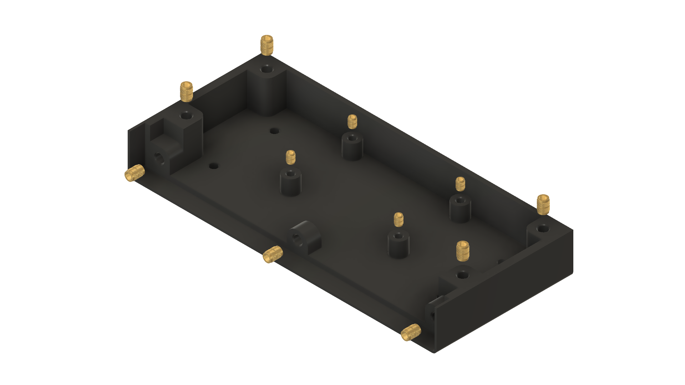
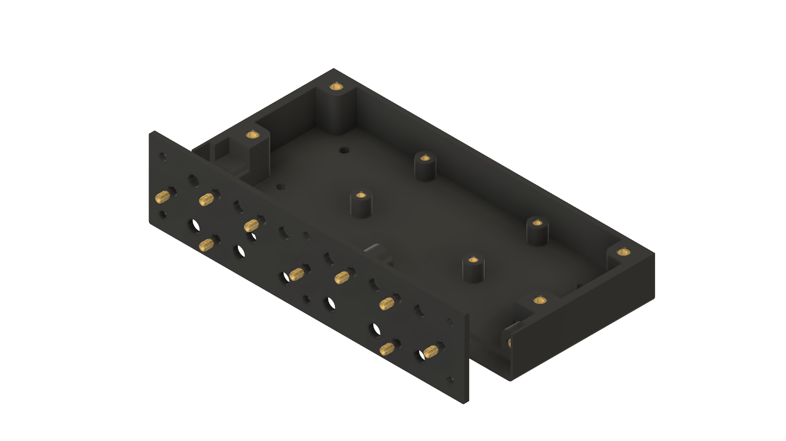
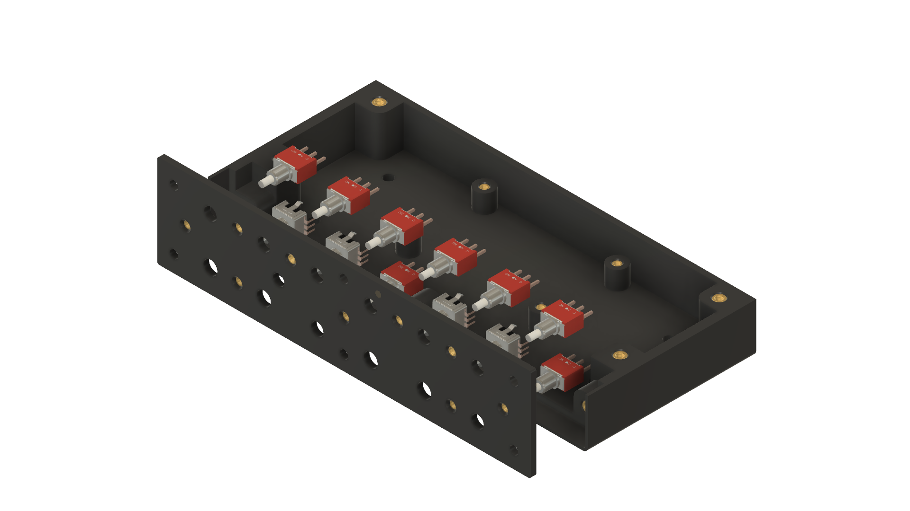
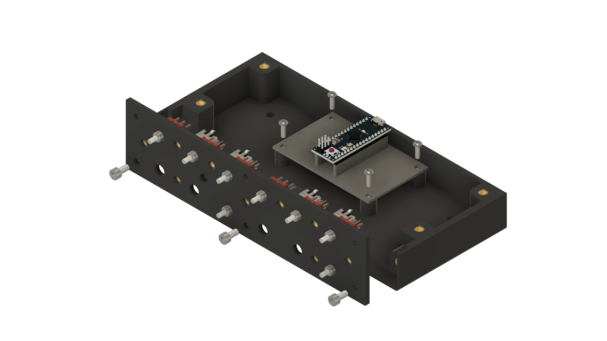
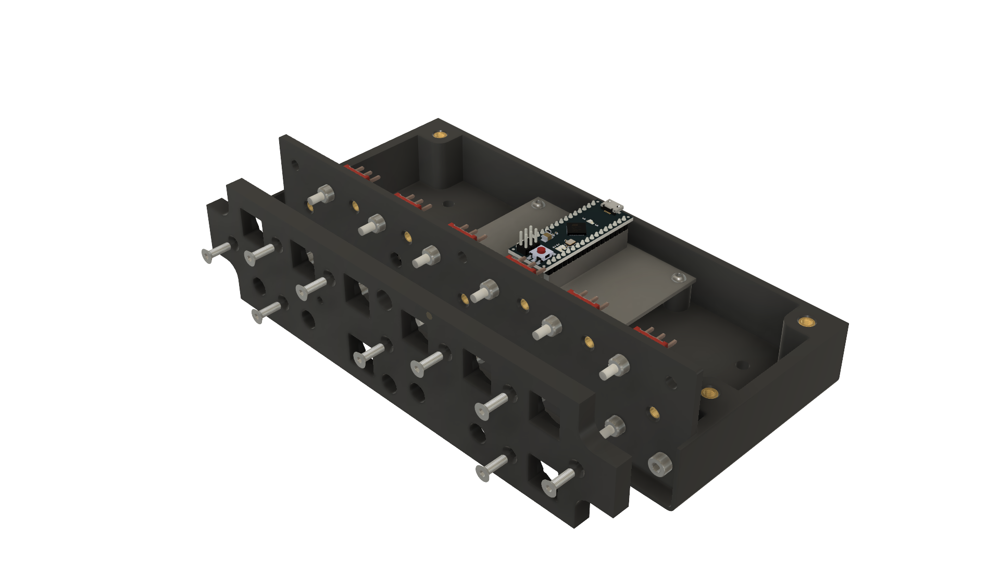
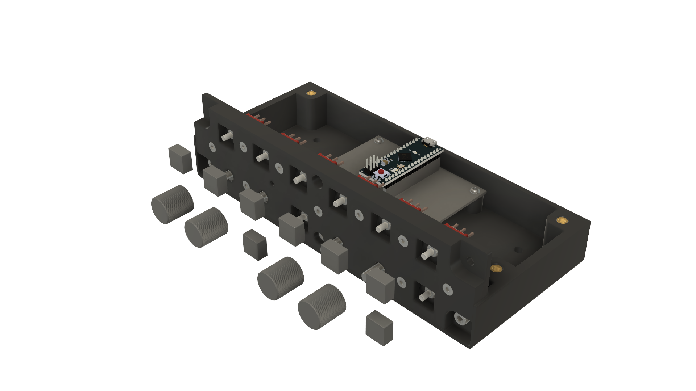
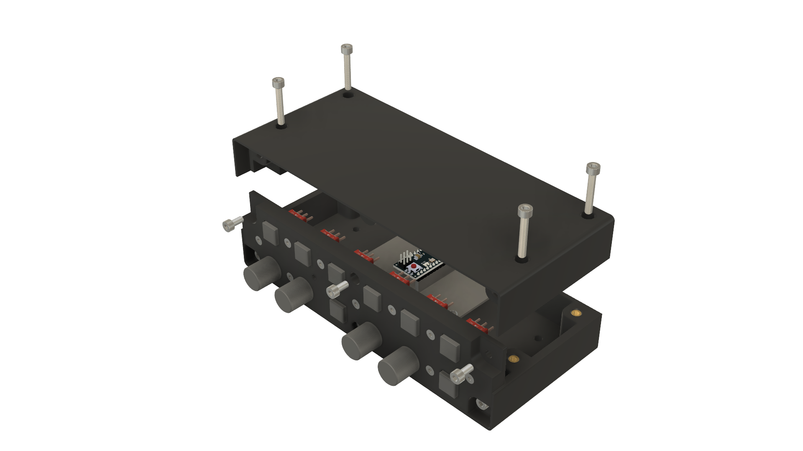
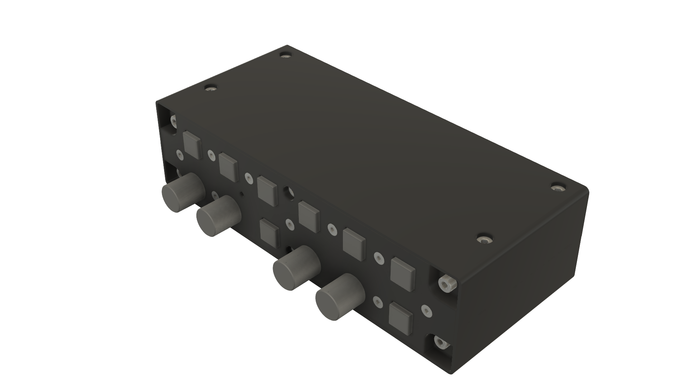

# Nobs Autopilot — Build Instructions

These are the hands-on build steps for the Nobs Autopilot panel: how to wire it,
how to assemble it, and how to verify it before binding in the sim. For the project
overview, parts list, costs, firmware loading, and the in-sim control mapping, see the
[main README](../README.md).

The wiring table and steps below show the **Arduino Nano ESP32** build — the main board for this
project. If you're using the older Arduino Micro instead, use the pin column for it in
[arduino-micro-wiring.md](arduino-micro-wiring.md).

## Hardware Connection Scheme

This is the wiring map: each control has one wire to a numbered pin on the Arduino, and one wire
to **GND** (ground). That's all — you don't need any resistors or extra parts, because the
firmware takes care of that for you.

The table below is for the **Arduino Nano ESP32**. Using the older **Arduino Micro**? The pins are
different — see [arduino-micro-wiring.md](arduino-micro-wiring.md) for its column.

> For a visual reference alongside this table, see the [wiring diagram](wiring-diagram.pdf).

| Component Group | Component Label | Hardware Connection | Arduino Nano ESP32 Pin | Virtual HID Button | Action Type |
| :--- | :--- | :--- | :--- | :--- | :--- |
| **Encoder 1** | Encoder 1 | Phase A Terminal | **D13** | Button 1 | CW Pulse |
| | Encoder 1 | Phase B Terminal | **A0** | Button 2 | CCW Pulse |
| | Encoder 1 | Switch Terminal 1 | **A1** | Button 3 | Push |
| **Encoder 2** | Encoder 2 | Phase A Terminal | **A2** | Button 4 | CW Pulse |
| | Encoder 2 | Phase B Terminal | **A3** | Button 5 | CCW Pulse |
| | Encoder 2 | Switch Terminal 1 | **A4** | Button 6 | Push |
| **Encoder 3** | Encoder 3 | Phase A Terminal | **A5** | Button 7 | CW Pulse |
| | Encoder 3 | Phase B Terminal | **A6** | Button 8 | CCW Pulse |
| | Encoder 3 | Switch Terminal 1 | **A7** | Button 9 | Push |
| **Encoder 4** | Encoder 4 | Phase A Terminal | **D0** | Button 10 | CW Pulse |
| | Encoder 4 | Phase B Terminal | **D1** | Button 11 | CCW Pulse |
| | Encoder 4 | Switch Terminal 1 | **D3** | Button 12 | Push |
| **Switches** | Switch 1 (SW1) | Terminal 2 (N.O.) | **D12** | Button 13 | Push |
| | Switch 2 (SW2) | Terminal 2 (N.O.) | **D11** | Button 14 | Push |
| | Switch 3 (SW3) | Terminal 2 (N.O.) | **D10** | Button 15 | Push |
| | Switch 4 (SW4) | Terminal 2 (N.O.) | **D9** | Button 16 | Push |
| | Switch 5 (SW5) | Terminal 2 (N.O.) | **D8** | Button 17 | Push |
| | Switch 6 (SW6) | Terminal 2 (N.O.) | **D7** | Button 18 | Push |
| | Switch 7 (SW7) | Terminal 2 (N.O.) | **D6** | Button 19 | Push |
| | Switch 8 (SW8) | Terminal 2 (N.O.) | **D5** | Button 20 | Push |
| **Ground Loop** | All Components | Common / GND Terminals | **GND** | *None* | System Ground |

> **Pin notes:**
> * Encoder 1's Phase A wire is on **D13**, which doubles as the board's built-in LED pin — that's why the onboard yellow LED stays lit whenever the firmware is running. It's harmless; move that wire to D2 or D4 (and update the firmware to match) if it bothers you.

## Physical Pinout Reference

### Rotary Encoder Layout
Viewed from the bottom of the housing with the three closely spaced pins facing downward:

```text
       [ Top: Encoder Shaft Side ]

         (A)      (C/GND)     (B)     <-- 3 Pins (Rotation Control)

          |          |         |

        (SW1)                (SW2)    <-- 2 Pins (Push Button Switch)
```
* **Wiring Rotation:** Connect `A` and `B` to their designated Arduino pins. Connect the middle pin `C/GND` to your master ground loop.
* **Wiring Button:** Connect `SW1` to its designated Arduino push-button pin. Connect `SW2` directly to your master ground loop.

### Momentary Switch Toggle Layout
Viewed from the rear showing three vertically aligned gold terminals:

```text
         [ ]  Terminal 1 (Common - C)             --> Connect to Master Ground Loop
         [ ]  Terminal 2 (Normally Open - N.O.)   --> Connect to Arduino Pin
         [ ]  Terminal 3 (Normally Closed - N.C.) --> LEAVE DISCONNECTED
```

## Assembly Instructions

Here's how the panel goes together, in order, with a photo of the real build at each stage.
There's soldering involved, so take your time and work in a well-lit, ventilated spot. Don't
rush — it's much easier to get each joint right the first time than to fix it later.

### Phase 1: Heat-Set Inserts



* **Press in the Inserts:** Using a soldering iron (or a dedicated insert tool) heated to the
  insert manufacturer's recommended temperature, press each M3/M4 heat-set insert squarely into
  its mounting post on the enclosure bottom. Go in slowly and keep the insert level — a crooked
  insert is the most common mistake here.
* **Do the Enclosure Top Too:** The enclosure top takes the same heat-set inserts in the same way.
  It isn't pictured separately — just repeat this step for it before moving on.



* **Mounting Plate:** Press heat-set inserts into the mounting plate's posts the same way.

### Phase 2: Switches and Encoders



* **Place the Switches and Encoders:** Insert the 8 toggle switches and 4 rotary encoders into
  their cutouts in the front plate, in the layout shown. Secure each one with its included washer
  and hex nut, tightened firmly by hand — avoid over-torquing the plastic.
* **Wire Them Up:** Following the [Hardware Connection Scheme](#hardware-connection-scheme) table
  above, solder a signal wire to each switch's N.O. terminal and each encoder's Phase A / Phase B /
  push-switch terminals, and tie all the ground terminals together into a common ground harness.
  Leave each switch's N.C. terminal disconnected. Slide heat shrink tubing over each joint before
  soldering and shrink it down afterward.

### Phase 3: Mounting Plate and Controller Board



* **Attach the Mounting Plate:** Fix the mounting plate to the rear of the enclosure bottom using
  the M4 × 6 mm socket-head screws.
* **Mount the Controller Board:** Secure the Arduino (Nano ESP32 or Micro) onto its standoffs in
  the enclosure bottom using the M3 pan-head screws.

### Phase 4: Mount the Front Plate



* **Route the Wires:** Feed the switch/encoder wire bundle from Phase 2 through the enclosure to
  the controller board, and solder each signal wire to its pin per the wiring table, and the
  common ground harness to a GND pin.
* **Join Front Plate to Shell:** Align the front plate (with switches and encoders already
  mounted) with the enclosure, and secure it with the designated M3 countersunk screws.

### Phase 5: Caps and Knobs



* **Fit the Switch Caps:** Press a button cap onto each of the 8 toggle switches.
* **Fit the Encoder Knobs:** Push an encoder knob onto each of the 4 rotary encoder shafts,
  aligning any internal flats with the shaft profile.

### Phase 6: Close Up the Enclosure



* **Secure Case Shells:** Lower the enclosure top onto the bottom half, making sure no wires are
  pinched, and lock the two shells together with the M4 × 26 mm socket-head screws.

### Phase 7: Finished Panel



That's a complete, assembled Nobs Autopilot panel, ready for the verification steps below.

## Verification & First-Time Setup

1. **Check for shorts first (before plugging in USB):** use a multimeter to make sure none of your
   ground wires are accidentally touching a signal wire. This catches wiring mistakes before they
   reach your PC.
2. **Load the firmware:** follow the guide for your board — [Arduino Nano ESP32](../firmware/arduino_eps32_nano/README.md)
   or [Arduino Micro](../firmware/arduino_micro/README.md).
3. **Confirm the name:** once plugged in, the panel should show up as `Nobs Autopilot (Vendor: 303a
   Product: 80f4)`. If it shows a generic name instead, open Windows **Device Manager**, turn on
   **View → Show hidden devices**, uninstall any old listings for the board, and replug it.
4. **Bind it in the sim:** launch MSFS 2024, go to **Options → Control Options**, pick the
   **Nobs Autopilot** device, and assign your buttons to autopilot commands (the
   [MSFS 2024 mapping template](../README.md#msfs-2024-autopilot-control-mapping-template) in the
   README is a ready-made starting point).
