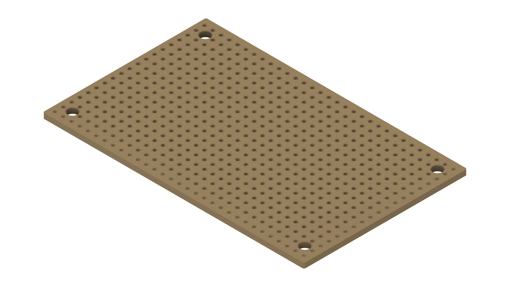
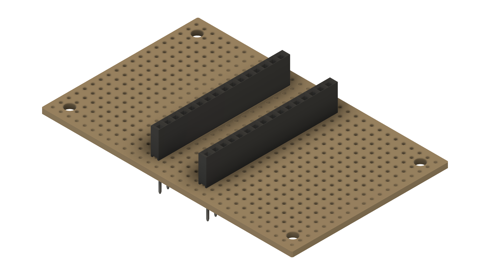
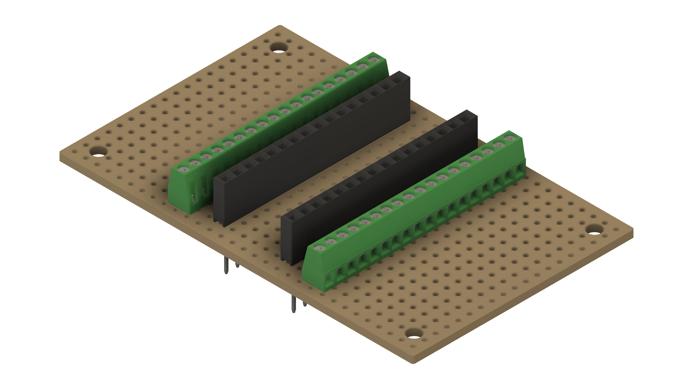
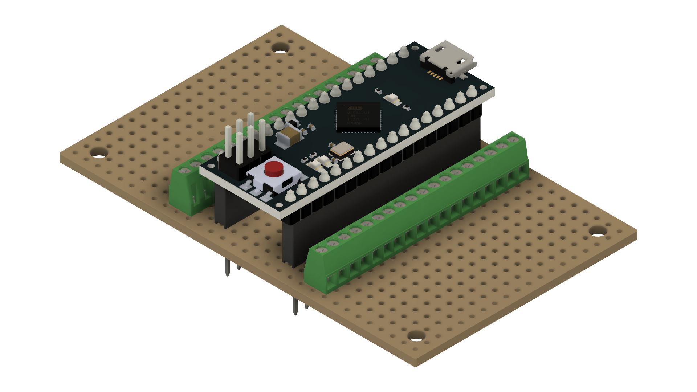
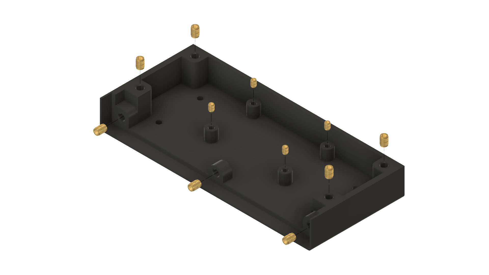
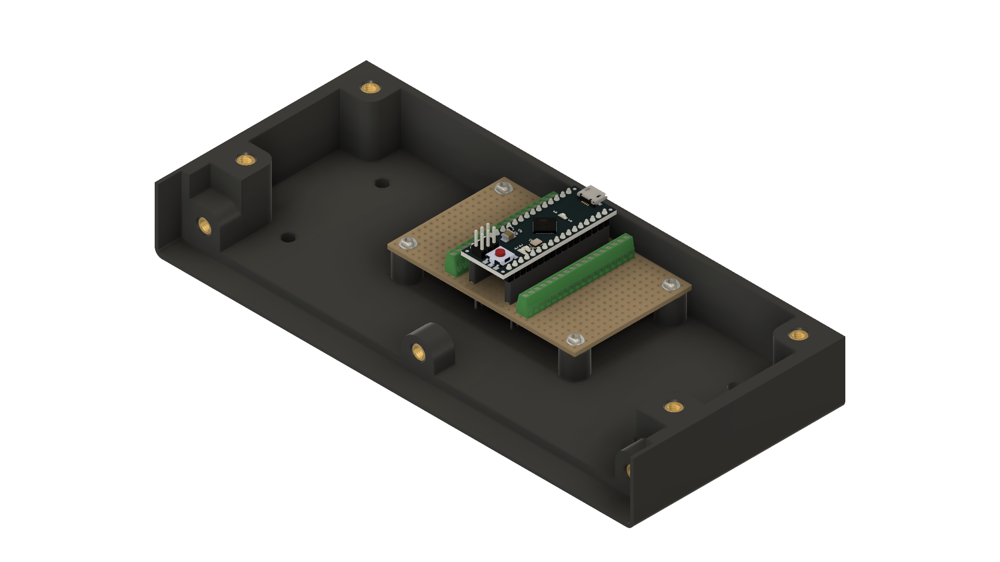

# Nobs Autopilot: Build Instructions

These are the hands-on build steps for the Nobs Autopilot panel: how to wire it,
how to assemble it, and how to verify it before binding in the sim. For the project
overview, firmware loading, and the in-sim control mapping, see the
[main README](../README.md). For the parts list and cost estimate, see
[bill-of-materials.md](bill-of-materials.md).

The wiring table and steps below show the **Arduino Nano ESP32** build, the main board for this
project. If you're using the older Arduino Micro instead, use the pin column for it in
[arduino-micro-wiring.md](arduino-micro-wiring.md).

## Hardware Connection Scheme

This is the wiring map: each control has one wire to a numbered pin on the Arduino, and one wire
to **GND** (ground). That's all: you don't need any resistors or extra parts, because the
firmware takes care of that for you.

The table below is for the **Arduino Nano ESP32**. Using the older **Arduino Micro**? The pins are
different; see [arduino-micro-wiring.md](arduino-micro-wiring.md) for its column.

> For a visual reference alongside this table, see the [wiring diagram](wiring-diagram.pdf).

| Component Group | Component Label | Hardware Connection | Arduino Nano ESP32 Pin | Virtual HID Button | Action Type |
| :--- | :--- | :--- | :--- | :--- | :--- |
| **Encoder 1** | Encoder 1 | Phase A Terminal | **D13** | Button 1 | CW Pulse |
| | Encoder 1 | Phase B Terminal | **A0** | Button 2 | CCW Pulse |
| | Encoder 1 | Switch Terminal 1 | **A1** | Button 3 | Push |
| **Encoder 2** | Encoder 2 | Phase A Terminal | **A2** | Button 4 | CW Pulse |
| | Encoder 2 | Phase B Terminal | **A3** | Button 5 | CCW Pulse |
| | Encoder 2 | Switch Terminal 1 | **A4** | Button 6 | Push |
| **Encoder 3** | Encoder 3 | Phase A Terminal | **A5** | Button 7 | CW Pulse |
| | Encoder 3 | Phase B Terminal | **A6** | Button 8 | CCW Pulse |
| | Encoder 3 | Switch Terminal 1 | **A7** | Button 9 | Push |
| **Encoder 4** | Encoder 4 | Phase A Terminal | **D0** | Button 10 | CW Pulse |
| | Encoder 4 | Phase B Terminal | **D1** | Button 11 | CCW Pulse |
| | Encoder 4 | Switch Terminal 1 | **D3** | Button 12 | Push |
| **Switches** | Switch 1 (SW1) | Terminal 2 (N.O.) | **D12** | Button 13 | Push |
| | Switch 2 (SW2) | Terminal 2 (N.O.) | **D11** | Button 14 | Push |
| | Switch 3 (SW3) | Terminal 2 (N.O.) | **D10** | Button 15 | Push |
| | Switch 4 (SW4) | Terminal 2 (N.O.) | **D9** | Button 16 | Push |
| | Switch 5 (SW5) | Terminal 2 (N.O.) | **D8** | Button 17 | Push |
| | Switch 6 (SW6) | Terminal 2 (N.O.) | **D7** | Button 18 | Push |
| | Switch 7 (SW7) | Terminal 2 (N.O.) | **D6** | Button 19 | Push |
| | Switch 8 (SW8) | Terminal 2 (N.O.) | **D5** | Button 20 | Push |
| **Ground Loop** | All Components | Common / GND Terminals | **GND** | *None* | System Ground |

> **Pin notes:**
> * Encoder 1's Phase A wire is on **D13**, which doubles as the board's built-in LED pin, which is why the onboard yellow LED stays lit whenever the firmware is running. It's harmless; move that wire to D2 or D4 (and update the firmware to match) if it bothers you.

## Physical Pinout Reference

### Rotary Encoder Layout
Viewed from the bottom of the housing with the three closely spaced pins facing downward:

```text
       [ Top: Encoder Shaft Side ]

         (A)      (C/GND)     (B)     <-- 3 Pins (Rotation Control)

          |          |         |

        (SW1)                (SW2)    <-- 2 Pins (Push Button Switch)
```
* **Wiring Rotation:** Connect `A` and `B` to their designated Arduino pins. Connect the middle pin `C/GND` to your master ground loop.
* **Wiring Button:** Connect `SW1` to its designated Arduino push-button pin. Connect `SW2` directly to your master ground loop.

### Momentary Switch Toggle Layout
Viewed from the rear showing three vertically aligned gold terminals:

```text
         [ ]  Terminal 1 (Common - C)             --> Connect to Master Ground Loop
         [ ]  Terminal 2 (Normally Open - N.O.)   --> Connect to Arduino Pin
         [ ]  Terminal 3 (Normally Closed - N.C.) --> LEAVE DISCONNECTED
```

## Assembly Instructions

Here's how the panel goes together, in order, with a photo of the real build at each stage.
There's soldering involved, so take your time and work in a well-lit, ventilated spot. Don't
rush: it's much easier to get each joint right the first time than to fix it later.

The build happens in four stages: (1) build the little breakout board the Arduino sits on, (2)
wire up the switches and knobs, (3) mount everything to the front plate, and (4) close it all up
in the case.

### Phase 1: Breakout Board Assembly



* **Fit Headers:** Position female socket headers onto the stripboard to seat your Arduino board
  (Nano ESP32 or Micro; the same stripboard layout fits either) and solder them from underneath.

  
* **Mount Terminal Blocks:** Place the screw terminal blocks flanking the socket headers on the
  stripboard and solder them into place.

  
* **Bridge Traces:** Ensure the copper traces on the stripboard securely connect each header pin
  footprint directly to its corresponding terminal block clamping slot.
* **Isolate Rails:** Use a track cutter or utility knife to score and break any copper traces
  running between opposing header pin rows to prevent short circuits.
* **Seat the Microcontroller:** Carefully align your Arduino board's pins with the female headers
  on the stripboard. Press down uniformly until fully seated.

  

### Phase 2: Component Pre-Wiring
* **Prep Signal Lines:** Cut hook-up wire into 15–20 cm lengths. Strip 3 mm of insulation off both ends of each wire run.
* **Wire the Switches:** Slide heat shrink tubing over your wires. Solder a signal wire to the N.O. terminal and a ground wire to the common terminal of each switch. Leave the N.C. terminal disconnected. Shrink the tubing over the joints.
* **Wire the Encoders:** Solder independent signal lines to Phase A and Phase B. Solder a third line to one push-switch terminal, and bridge the middle ground terminal to the second push-switch terminal with a shared wire.
* **Construct Ground Harness:** Tie the ground wires from all encoders and switches together into a unified, clean common ground harness to minimize terminal usage.

### Phase 3: Faceplate Assembly
* **Install Hardware:** Insert the pre-wired switches and encoders through the mounting holes from the back of the front plate.
* **Tighten Fasteners:** Secure the components to the front plate using their included washers and hex nuts. Tighten firmly by hand, avoiding excessive torque on the plastic.
* **Attach Knobs:** Push the interface knobs onto the encoder shafts, aligning any internal flats with the shaft profiles.
* **Join Faceplate to Shell:** Align the completed front plate with the enclosure top. Secure them together using the designated M3 countersunk screws.

### Phase 4: Enclosure Integration



* **Press in the Inserts:** Using a soldering iron (or a dedicated insert tool) heated to the
  insert manufacturer's recommended temperature, press the heat-set inserts squarely into the
  enclosure bottom's mounting posts. Do the same for the enclosure top: it isn't pictured
  separately, but takes the same inserts the same way.
* **Mount the Base Board:** Secure the completed breakout board sub-assembly into the enclosure
  bottom using the M3 pan-head screws.

  
* **Terminate Wires:** Route the front-plate wire bundles neatly through the case. Insert each individual signal wire into its designated screw terminal block port and lock down firmly.
* **Attach Mounting Plate:** Fix the mounting plate bracket to the rear of the enclosure bottom using the M4 × 6 mm socket-head screws.
* **Secure Case Shells:** Close the enclosure top and bottom halves together, ensuring no wires are pinched. Lock the shell with the M4 × 26 mm socket-head screws.

## Verification & First-Time Setup

1. **Check for shorts first (before plugging in USB):** use a multimeter to make sure none of your
   ground wires are accidentally touching a signal wire. This catches wiring mistakes before they
   reach your PC.
2. **Load the firmware:** follow the guide for your board: [Arduino Nano ESP32](../firmware/arduino_eps32_nano/README.md)
   or [Arduino Micro](../firmware/arduino_micro/README.md).
3. **Confirm the name:** once plugged in, the panel should show up as `Nobs Autopilot (Vendor: 303a
   Product: 80f4)`. If it shows a generic name instead, open Windows **Device Manager**, turn on
   **View → Show hidden devices**, uninstall any old listings for the board, and replug it.
4. **Bind it in the sim:** launch MSFS 2024, go to **Options → Control Options**, pick the
   **Nobs Autopilot** device, and assign your buttons to autopilot commands.
